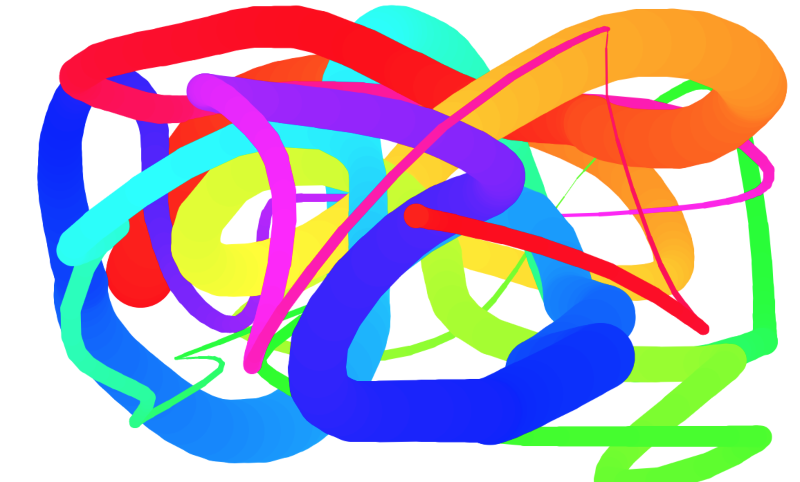

Рисование в браузере
===

Реализуйте примитивный инструмент рисования:

## Функционал

При открытии страницы необходимо установить размер холста равным размеру окна браузера. При изменении размеров окна бразуера необходимо обновить размер холста и очистить его.

При движении по холсту мыши с нажатой левой кнопкой необходимо рисовать на холсте линию. Если кнопка мыши отпущена, то линия не рисуется. Если мышь вышла за пределы холста и потом вернулась, линия не рисуется. Для рисования используются координаты положения мыши.

При двойном клике холст необходимо очищать.

## Характеристики линии

Цвет линии задается с помощью [цветовой модели HSL](https://ru.wikipedia.org/wiki/HSL). Насыщенность `100%`, светлота `50%`.

Оттенок меняется при каждом тике на единицу в диапазоне от `0` до `359` включительно. При этом, если нажата клавиша `Shift`, то он уменьшается, иначе увеличивается. Если оттенок достиг максимума или минимума, то значение устанавливается в минимум или максимум соответственно.

Толщина линии меняется при каждом тике на единицу в диапазоне от `5` до `100` включительно. Начинать нужно со `100`. При достижении максимума толщина должна уменьшаться. При достижении минимума — увеличиваться.

Необходимо скруглить края линии, задав свойствам контекста `lineJoin` и `lineCap` значение `round`.

## Реализация

При реализации нельзя изменять HTML-код и CSS-стили.

### Локально с использованием git

Реализацию необходимо поместить в файл `./js/draw.js`. Файл уже подключен к документу, поэтому другие файлы изменять не требуется.

### В песочнице CodePen

Реализуйте функционал во вкладке JS. Перед началом работы сделайте форк этого пена:

https://codepen.io/dfitiskin/pen/OjOwqZ
