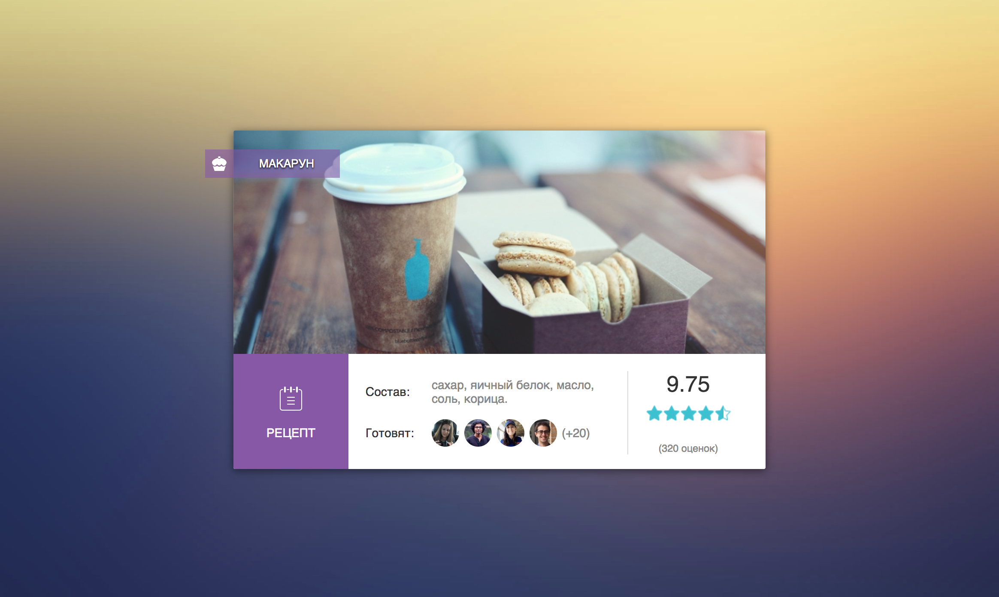

# Задача 3. Рецепты

#### В рамках домашнего задания к лекции «Cовместное использование ресурсов между разными источниками»

## Описание

Вам необходимо реализовать виджет рецепта:



## Данные

Данные рецепта доступны в формате JSONP по адресу `https://neto-api.herokuapp.com/food/42`, имя функции можно передать GET-параметром `callback`.

Информация о рецепте — это объект со следующими свойствами:
- `id` — идентификатор;
- `title` — название;
- `ingredients` — список ингредиентов, _массив строк_;
- `pic` — фотография.

Рейтинг рецепта в формате JSONP доступен по адресу `https://neto-api.herokuapp.com/food/42/rating`. Это объект со свойствами:
- `rating` — рейтинг рецепта, _число_ от 0 до 10;
- `votes` — количество голосов, _число_.

Список пользователей — _массив объектов_ со свойствами:
- `name` — имя;
- `pic` — аватарка.

Тоже доступен в формате JSONP по адресу `https://neto-api.herokuapp.com/food/42/consumers`. Передается `4` пользователя в свойстве `list` и общее количество пользователей в свойстве `total`.

## Интерфейс

При открытии страницы необходимо загрузить данные рецепта, его рейтинг и список пользователей. И отобразить их в интерфейсе.

Для подстановки данных рецепта в HTML-разметку используйте элементы со следующими атрибутами:
- `data-pic` — добавьте фотографию фоновой картинкой элемента;
- `data-title` — название рецепта, подставляйте в тело тега;
- `data-ingredients` — состав, добавьте ингредиенты через запятую;
- `data-rating` — рейтинг, округлите до двух знаков после запятой;
- `data-star` — добавьте ширину в процентах, учитывая текущий рейтинг и то, что `100%` соответствуют рейтингу `10`;
- `data-votes` — количество голосов в формате `(540 оценок)`;
- `data-consumers` — список пользователей.

Каждый пользователь — это картинка, имя добавляется в атрибут `title`:
```html

```

После всех пользователей необходимо вывести количество пользователей, которые не показаны в формате:
```html
<span>(+20)</span>
```

## Реализация

При реализации нельзя изменять HTML-код и CSS-стили.

### В песочнице CodePen

Реализуйте функционал на вкладке JS.

В онлайн-песочнице на [CODEPEN](https://codepen.io/dfitiskin/pen/MvJLBy).

### Локально с использованием git

Реализацию необходимо поместить в файл `./js/food.js`. Файл уже подключен к документу, поэтому другие файлы изменять не требуется.

В репозитории на [GitHub](https://github.com/netology-code/hj-homeworks/tree/master/cors/food).

## Инструкция по выполнению домашнего задания

### В онлайн-песочнице

Потребуется только ваш браузер.

1. Открыть код в [песочнице](https://codepen.io/dfitiskin/pen/MvJLBy).
2. Нажать кнопку «Fork».
3. Выполнить задание.
4. Нажать кнопку «Save».
5. Скопировать адрес страницы, открытой в браузере.
6. Прислать скопированную ссылку через личный кабинет на сайте [netology.ru](http://netology.ru/).    

### Локально

Потребуются: браузер, редактор кода, система контроля версий [git](https://git-scm.com), установленная локально, и аккаунт на [GitHub](https://github.com/) или [BitBucket](https://bitbucket.org/).

1. Клонировать репозиторий с домашними заданиями `git clone https://github.com/netology-code/hj-homeworks.git`.
2. Перейти в папку задания `cd hj-homeworks/cors/food`.
3. Выполнить задание.
4. Создать репозиторий на [GitHub](https://github.com/) или [BitBucket](https://bitbucket.org/).
5. Добавить репозиторий в проект `git remote add homeworks %repo-url%`, где `%repo-url%` — адрес созданного репозитория.
6. Опубликовать код в репозиторий `homeworks` с помощью команды `git push -u homeworks master`.
7. Прислать ссылку на репозиторий через личный кабинет на сайте [netology.ru](http://netology.ru/).
