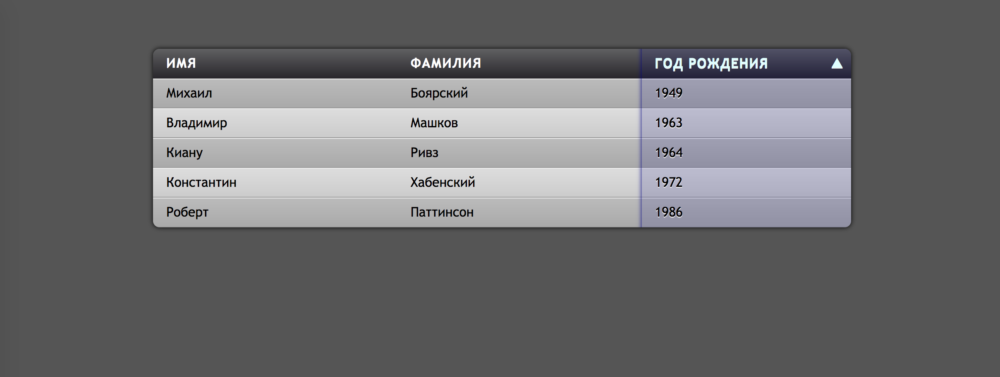

# Задача 2. Сортировка таблицы

#### В рамках домашнего задания к лекции «Принцип обработки событий»

## Описание

Необходимо реализовать сортировку таблицы при клике на ячейку заголовка. При первом клике на заголовок необходимо отсортировать данные по возрастанию. При повторном — в обратном направлении:

## Интерфейс

Сортировка должна осуществляться при клике на тег `<th>` у которого задан атрибут `data-prop-name`, в котором указано поле, по которому необходимо отсортировать данные таблицы.

Для указания направления сортировки необходимо добавить заголовку атрибут `data-dir` со значением `1` для сортировки по возрастанию и `-1` для сортировки по убыванию.

Также необходимо таблице добавить атрибут `data-sort-by`, в который поместить название поля, по которому осуществляется сортировка.

Для непосредственно сортировки рядов таблицы используйте функцию `sortTable`. Функция принимает два аргумента:
- `field` — название поля, по которому сортировать таблицу, _строка_;
- `direction` — направление сортировки, _число_, `1` для сортировки по возрастанию и `-1` для сортировки по убыванию.

## Реализация

При реализации нельзя изменять HTML-код и CSS-стили, а также предоставленный JavaScript-код, за исключением функции `handleTableClick`.

### В песочнице CodePen

Реализуйте функцию `handleTableClick` во вкладке JS.

В онлайн-песочнице на [CODEPEN](https://codepen.io/dfitiskin/pen/gRLVzr).

### Локально с использованием git

Реализацию необходимо поместить в файл `./js/sort.js`. Файл уже подключен к документу, поэтому другие файлы изменять не требуется.

В репозитории на [GitHub](https://github.com/netology-code/hj-homeworks/tree/master/event-bubbling-capturing/table/).

## Инструкция по выполнению домашнего задания

### В онлайн-песочнице

Потребуется только ваш браузер.

1. Открыть код в [песочнице](https://codepen.io/dfitiskin/pen/gRLVzr).
2. Нажать кнопку «Fork».
3. Выполнить задание.
4. Нажать кнопку «Save».
5. Скопировать адрес страницы, открытой в браузере.
6. Прислать скопированную ссылку через личный кабинет на сайте [netology.ru](http://netology.ru/).    

### Локально

Потребуются: браузер, редактор кода, система контроля версий [git](https://git-scm.com), установленная локально, и аккаунт на [GitHub](https://github.com/) или [BitBucket](https://bitbucket.org/).

1. Клонировать репозиторий с домашними заданиями `git clone https://github.com/netology-code/hj-homeworks.git`.
2. Перейти в папку задания `cd hj-homeworks/event-bubbling-capturing/table`.
3. Выполнить задание.
4. Создать репозиторий на [GitHub](https://github.com/) или [BitBucket](https://bitbucket.org/).
5. Добавить репозиторий в проект `git remote add homeworks %repo-url%`, где `%repo-url%` — адрес созданного репозитория.
6. Опубликовать код в репозиторий `homeworks` с помощью команды `git push -u homeworks master`.
7. Прислать ссылку на репозиторий через личный кабинет на сайте [netology.ru](http://netology.ru/).
