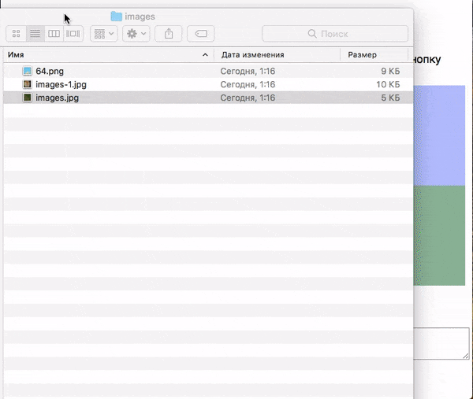

# Создание коллажей по типу Instagram Layout

Необходимо сделать сервис создания коллажа.

В вашем распоряжении - разметка коллажа 1 на 2 картинки.

Необходимо реализовать:
1. Каждый раз, когда файл переносится в активное окно изображения,
необходимо отобразить в нем загруженную картинку. 
Если она не помещается в окне, нужно показать только её часть.
2. После нажатия на кнопку «Получить коллаж», 
в блоке «Ваш коллаж», вы должны получить финальное изображение.
3. В случае, если файл не является изображением, необходимо показывать сообщение с
ошибкой.

## Пример работы

## Рекомендации

1. Добавляйте новое изображение в контейнер 
\
 и добавьте данной картинке 
заранее подготовленный CSS-класс *layout__image*. В итоге, ваше изображение будет выглядеть
так: \
2. Для визуализации наведения изображения на контейнер \
 
добавляйте ему заранее подготовленный CSS-класс *layout__item_active*.

Подключение обработчиков событий следует описывать в методе *registerEvents*

## Инструкция по выполнению домашнего задания

### В онлайн-песочнице

Потребуется только ваш браузер.

1. Открыть код в [песочнице](https://jsfiddle.net/usefulwebit/gspyn28k/).
2. Нажать кнопку «Fork».
3. Выполнить задание.
4. Нажать кнопку «Save».
5. Скопировать адрес страницы, открытой в браузере.
6. Прислать скопированную ссылку через личный кабинет на сайте [netology.ru](http://netology.ru/).    

### Локально

Потребуются: браузер, редактор кода, система контроля версий [git](https://git-scm.com), установленная локально, и аккаунт на [GitHub](https://github.com/) или [BitBucket](https://bitbucket.org/).

1. Клонировать репозиторий с домашними заданиями `git clone https://github.com/netology-code/hj-homeworks.git`.
2. Перейти в папку задания `cd hj-homeworks/file-api/instagram-layout`.
3. Выполнить задание.
4. Создать репозиторий на [GitHub](https://github.com/) или [BitBucket](https://bitbucket.org/).
5. Добавить репозиторий в проект `git remote add homeworks %repo-url%`, где `%repo-url%` — адрес созданного репозитория.
6. Опубликовать код в репозиторий `homeworks` с помощью команды `git push -u homeworks master`.
7. Прислать ссылку на репозиторий через личный кабинет на сайте [netology.ru](http://netology.ru/).

