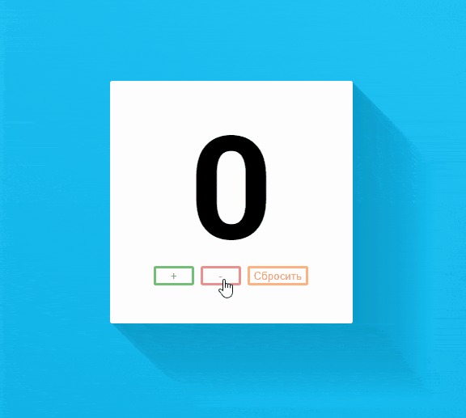

# Задача 1. Персональный счетчик

#### В рамках домашнего задания к лекции «Хранение состояния на клиенте и отправка на сервер»

## Описание

Необходимо реализовать простой персональный счётчик, который запоминает своё текущее состояние:

## Интерфейс

Для отображения текущего значения счётчика используйте узел с идентификатором `counter`.

Также реализуйте обработку клика на следующие кнопки:
- «+» — идентификатор `increment`;
- «-» — идентификатор `decrement`;
- «Сбросить» — идентификатор `reset`.

## Функционал

При открытии страницы счётчик должен показывать значение `0`, либо последнее значение, которое было на момент закрытия окна браузера.

Каждый пользователь, открывший страницу счётчика, видит своё состояние счётчика. Другие пользователи не могут на него повлиять. Но если пользователь пользовался счётчиком из одного браузера и потом открыл счётчик в другом, то счётчик начинается с `0`.

При клике на кнопку «+» значение счётчика увеличивается на `1`. При клике на кнопку «-» — уменьшается на `1`, только если текущее значение больше `0`. При клике на кнопку «Сбросить» — текущее значение устанавливается в `0`.

## Реализация

При реализации нельзя изменять HTML-код и CSS-стили.

### В песочнице CodePen

Реализуйте функционал вкладке JS.

В онлайн-песочнице на [CODEPEN](https://codepen.io/dfitiskin/pen/rzeoBe).

### Локально с использованием git

Реализацию необходимо поместить в файл `./js/counter.js`. Файл уже подключен к документу, поэтому другие файлы изменять не требуется.

В репозитории на [GitHub](https://github.com/netology-code/hj-homeworks/tree/master/local-storage/counter).

## Инструкция по выполнению домашнего задания

### В онлайн-песочнице

Потребуется только ваш браузер.

1. Открыть код в [песочнице](https://codepen.io/dfitiskin/pen/rzeoBe).
2. Нажать кнопку «Fork».
3. Выполнить задание.
4. Нажать кнопку «Save».
5. Скопировать адрес страницы, открытой в браузере.
6. Прислать скопированную ссылку через личный кабинет на сайте [netology.ru](http://netology.ru/).    

### Локально

Потребуются: браузер, редактор кода, система контроля версий [git](https://git-scm.com), установленная локально, и аккаунт на [GitHub](https://github.com/) или [BitBucket](https://bitbucket.org/).

1. Клонировать репозиторий с домашними заданиями `git clone https://github.com/netology-code/hj-homeworks.git`.
2. Перейти в папку задания `cd hj-homeworks/local-storage/counter`.
3. Выполнить задание.
4. Создать репозиторий на [GitHub](https://github.com/) или [BitBucket](https://bitbucket.org/).
5. Добавить репозиторий в проект `git remote add homeworks %repo-url%`, где `%repo-url%` — адрес созданного репозитория.
6. Опубликовать код в репозиторий `homeworks` с помощью команды `git push -u homeworks master`.
7. Прислать ссылку на репозиторий через личный кабинет на сайте [netology.ru](http://netology.ru/).
