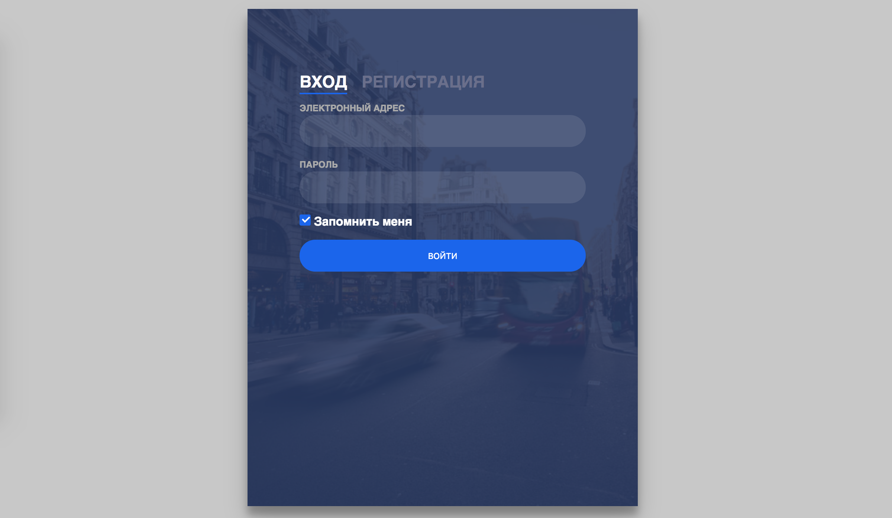

# Задача 2. Форма авторизации и регистрации

#### В рамках домашнего задания к лекции «Хранение состояния на клиенте и отправка на сервер»

## Описание

Реализуйте работу форм входа и регистрации:

## Интерфейс

Вам потребуются две формы:
- Форма входа имеет класс `sign-in-htm`.
- Форма регистрации имеет класс `sign-up-htm`.

В каждой из форм есть поле `output` для вывода сообщений с классом `error-message`.

## Функционал

При отправке формы входа необходимо отправить данные формы POST-запросом на адрес `https://neto-api.herokuapp.com/signin` в JSON-формате.

При отправке формы входа необходимо отправить данные формы POST-запросом на адрес `https://neto-api.herokuapp.com/signup` в JSON-формате.

Оба запроса имеют идентичные форматы ответа. В случае ошибки возвращается JSON-объект со свойствами:
- `error` — состояние ошибки, будет равно `true`,
- `message` — сообщение об ошибке.

В случае успеха будет возвращен объект пользователя со свойствами:
- `email` — электронная почта пользователя,
- `name` — имя пользователя.

В случае ошибки необходимо вывести сообщение об ошибке в поле для сообщений. В случае успеха необходимо вывести одну из двух шаблонных фраз:
- «Пользователь Иван успешно авторизован» — в случае успешного входа.
- «Пользователь Иван успешно зарегистрирован» — в случае успешной регистрации.

## Реализация

При реализации нельзя изменять HTML-код и CSS-стили.

### Локально с использованием git

Реализацию необходимо поместить в файл `./js/auth.js`. Файл уже подключен к документы, поэтому другие файлы изменять не требуется.

### В песочнице CodePen

Реализуйте функционал вкладке JS.

В онлайн-песочнице на [CODEPEN](https://codepen.io/dfitiskin/pen/PKNgmL).

### Инструкция по выполнению домашнего задания

#### В онлайн-песочнице

Потребуется: только ваш браузер.

1. Открыть код в [песочнице](https://codepen.io/dfitiskin/pen/PKNgmL).

2. Нажать на кнопку «Fork».

3. Выполнить задание.

4. Нажать кнопку «Save».

5. Скопировать адрес страницы, открытой в браузере.

6. Прислать скопированную ссылку через личный кабинет на сайте [netology.ru](http://netology.ru/).    

#### Локально

Потребуется: браузер, редактор кода, система контроля версий [git](https://git-scm.com), установленная локально, и аккаунт на [GitHub](https://github.com/) или [BitBucket](https://bitbucket.org/).

1. Клонировать репозиторий с домашними заданиями `git clone https://github.com/netology-code/hj-homeworks.git`.

2. Перейти в папку задания `cd hj-homeworks/local-storage/sign-in-form`.

3. Выполнить задание.

4. Создать репозиторий на [GitHub](https://github.com/) или [BitBucket](https://bitbucket.org/).

5. Добавить репозиторий в проект `git remote add homeworks %repo-url%`, где `%repo-url%` — адрес созданного репозитория.

6. Опубликовать код в репозиторий `homeworks` с помощью команды `git push -u homeworks master`.

7. Прислать ссылку на репозиторий через личный кабинет на сайте [netology.ru](http://netology.ru/).
