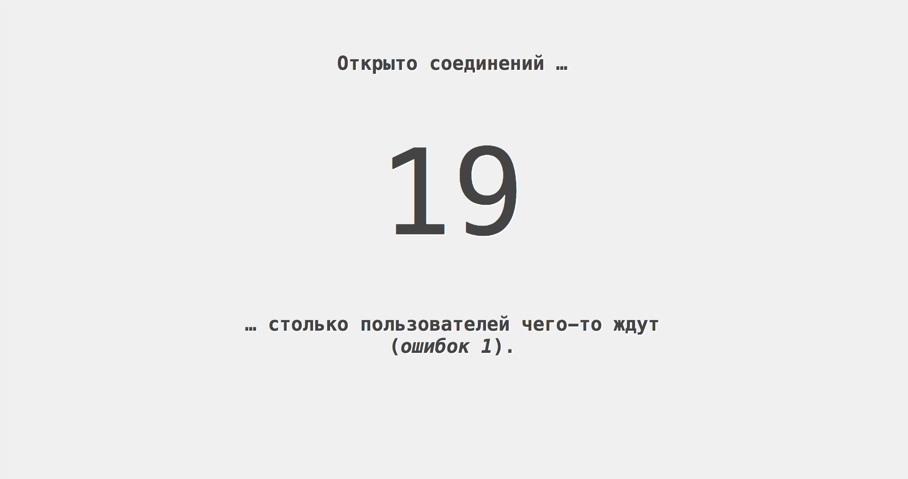

# Задача 2. Счетчик открытых соединений

#### В рамках домашнего задания к лекции «Веб-сокеты»

## Описание

Вам необходимо отобразить информацию о количестве открытых веб-сокет соединений с сервером, а также о количестве ошибок при закрытии соединения:

## Интерфейс

Для отображения количества открытых соединений поместите их количество в тело тега с классом `counter`.

Для отображения количества ошибок при закрытии соединения поместите их в тег `output.errors`.

## Функционал

При открытии страницы необходимо установить веб-сокет соединение с сервером `wss://neto-api.herokuapp.com/counter`.

При закрытии страницы необходимо закрыть соединение с кодом `1000`.

По веб-сокет соеденению передаются актуальные данные о количестве открытых соединений и количестве ошибок в формате JSON-объекта с ключами:
- `connections` — количество открытых соединений;
- `errors` — количество ошибок закрытия.

Вам необходимо обновлять эту информацию на странице.

## Реализация

При реализации нельзя изменять HTML-код и CSS-стили.

### В песочнице CodePen

Реализуйте функционал вкладке JS.

В онлайн-песочнице на [CODEPEN](https://codepen.io/dfitiskin/pen/awPoaw).

### Локально с использованием git

Реализацию необходимо поместить в файл `./js/counter.js`. Файл уже подключен к документу, поэтому другие файлы изменять не требуется.

В репозитории на [GitHub](https://github.com/netology-code/hj-homeworks/tree/master/websocket/counter).

## Инструкция по выполнению домашнего задания

### В онлайн-песочнице

Потребуется только ваш браузер.

1. Открыть код в [песочнице](https://codepen.io/dfitiskin/pen/awPoaw).
2. Нажать кнопку «Fork».
3. Выполнить задание.
4. Нажать кнопку «Save».
5. Скопировать адрес страницы, открытой в браузере.
6. Прислать скопированную ссылку через личный кабинет на сайте [netology.ru](http://netology.ru/).    

### Локально

Потребуются: браузер, редактор кода, система контроля версий [git](https://git-scm.com), установленная локально, и аккаунт на [GitHub](https://github.com/) или [BitBucket](https://bitbucket.org/).

1. Клонировать репозиторий с домашними заданиями `git clone https://github.com/netology-code/hj-homeworks.git`.
2. Перейти в папку задания `cd hj-homeworks/websocket/counter`.
3. Выполнить задание.
4. Создать репозиторий на [GitHub](https://github.com/) или [BitBucket](https://bitbucket.org/).
5. Добавить репозиторий в проект `git remote add homeworks %repo-url%`, где `%repo-url%` — адрес созданного репозитория.
6. Опубликовать код в репозиторий `homeworks` с помощью команды `git push -u homeworks master`.
7. Прислать ссылку на репозиторий через личный кабинет на сайте [netology.ru](http://netology.ru/).
